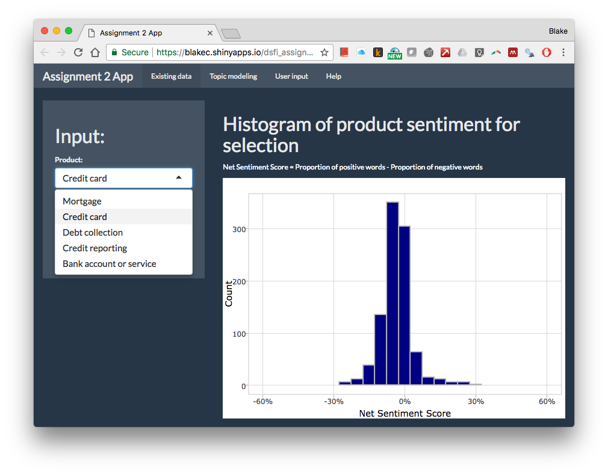
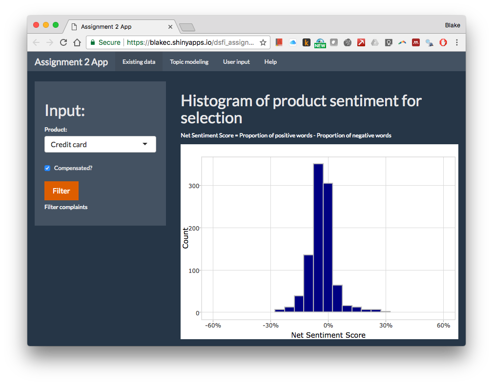
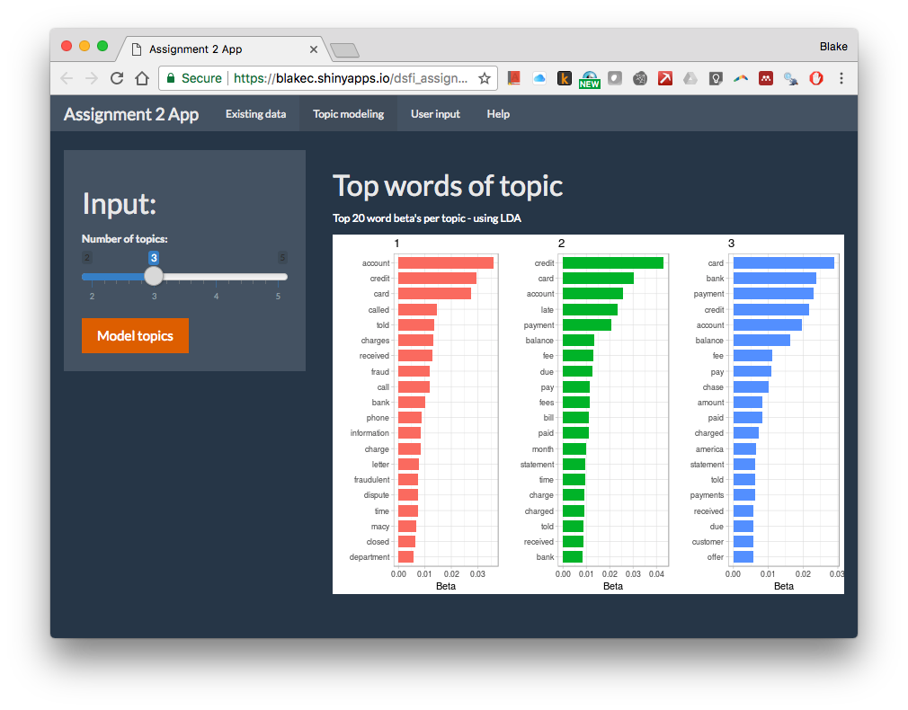
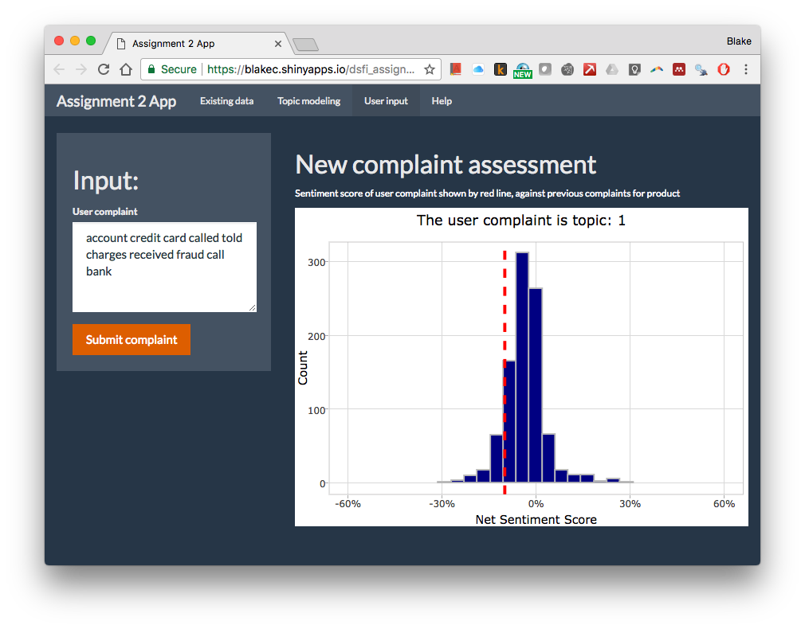

Shiny app instructions with example
================
Blake Cuningham CNNBLA001

-   [Opening the app](#opening-the-app)
-   [Selecting parameters and intepreting histogram](#selecting-parameters-and-intepreting-histogram)
-   [Topic modeling](#topic-modeling)
-   [Evaluating a new complaint](#evaluating-a-new-complaint)
-   [Changing product and compensation status](#changing-product-and-compensation-status)

Opening the app
===============

The shiny app is hosted at <https://blakec.shinyapps.io/dsfi_assignment_2/> . Please navigate to the link and wait for the app to load.

Selecting parameters and intepreting histogram
==============================================

We are interested in describing specific portions of our data at a time. The complaints data can be segmented into 10 different parts: users who were and were not compensated after their complaint for each of 5 product types. In order to choose a segment:

1.  Select the product

1.  Select whether the customers were compensated or not
2.  Click the orange "filter" button, and wait for the histogram to load

This histogram represents the distribution of net sentiment scores for the matching documents. You can select a new product segment and observe the change in the histogram to compare distribution characteristics.

The net sentiment score is defined as being the proportion of positive words, less the proportion of negative words. Hence, complains with more positive words will be represented by bars to the right of 0 on the histogram.

Topic modeling
==============

Topic modeling uses the vector of words in each complaint in order to assign it to one of a predefined number of topics. In this case, each topic would be a topic within the set of complaints for a particular product and compensation status. These topics would represent highly specific topics within that segment e.g. a person may complain about fraud on their credit card, or may complain about poor service from their credit card provider. Hopefully, the topic modeling process finds these topics allowing us to better able to classify complaints.

In order to find topics:

1.  Navigate to the "Topic modelling" tab
2.  Select the number of topics you wish to find by using the slider on the left
3.  Click the orange button "Model topics"
4.  Wait a few seconds for the modeling process to happen, and for the chart to display

The chart shows the top words (ranked by beta) for each of the found topics. These are the words that have the largest impact on determining the likelihood that a complaint document is classified as one of these topics. One can get a feel for the subject of the topic by observing these top ranked words.

Evaluating a new complaint
==========================

Now that we know the distribution of complaints, and the flavor of the topic within, we can see where a new unseen complaint may fit - given that it is of the selected product type and compensation status.

To see the analysis of the new complaint:

1.  Navigate to the "User input" tab
2.  Enter the complaint text into the text area
3.  Click the orange "Submit complaint" button

The chart on the right-hand side will now show two things:

-   The sentiment of the new complaint compared to the previous related complaints, to potentially help gauge priority (if one were looking to address the most negative complaints first), represented by the position of the vertical red line
-   The likely topic of the new complaint is stated in the chart title (in the example below, some of the top words from topic 1 were entered, and the resultant topic was indeed topic 1)

Changing product and compensation status
========================================

If you want to change the product and compensation status:

1.  Navigate back to the "Existing data" tab
2.  Select new parameters
3.  Proceed as described above
